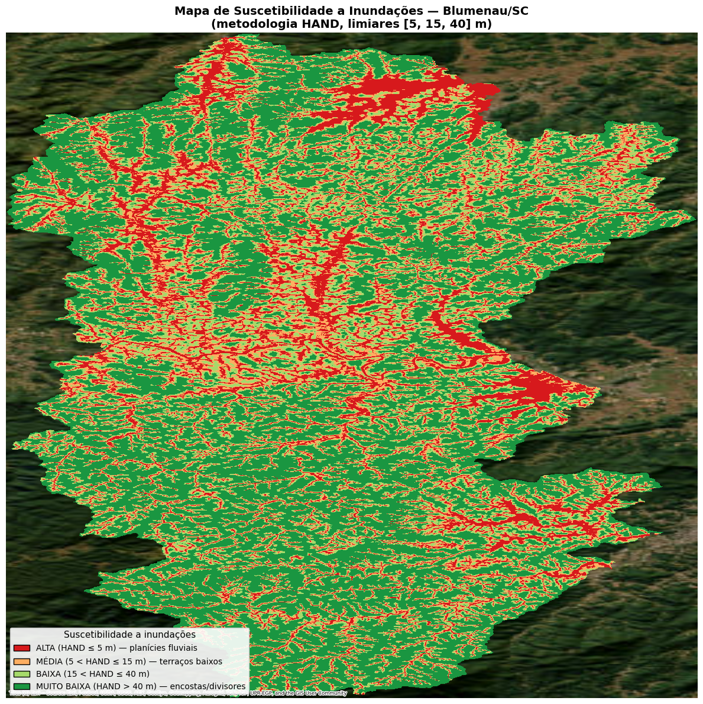

# Americas-TechGuard-Semana6

# TechGuard — HAND para Blumenau/SC

Mapa de suscetibilidade a inundações para o município de **Blumenau/SC** gerado pela metodologia **HAND** (*Height Above Nearest Drainage*), no contexto do projeto acadêmico **Americas TechGuard** (UniSENAI/SC, Campus Florianópolis).

Trabalho de adaptação a partir do código-base do **Prof. Alex Salazar**, originalmente desenvolvido para Porto Alegre/RS.

---

## Mapa final



Resultados quantitativos na área de contribuição hidrográfica (2.228 km²):

| Classe | Limite HAND (m) | % da área |
|---|---|---|
| ALTA | ≤ 5 | **16,75%** |
| MÉDIA | 5–15 | 14,12% |
| BAIXA | 15–40 | 23,91% |
| MUITO BAIXA | > 40 | 45,22% |

O padrão espacial é coerente com o histórico de enchentes do Vale do Itajaí-Açu: zonas de ALTA suscetibilidade concentradas no eixo central do Itajaí-Açu (área urbana de Blumenau) e ao longo dos ribeirões Velha, Garcia, Itoupava e Fortaleza.

---

## Como rodar

### Opção A — Google Colab (recomendado)

1. Faça upload do `.ipynb` deste repositório para a sua MyDrive.
2. Abra o notebook no Colab.
3. Execute as células em ordem. As 2 primeiras montam o Drive e localizam a pasta do projeto; as demais baixam dados oficiais (IBGE, ANA, ANADEM), processam o DEM e geram o mapa.
4. Em Colab, o pipeline pesado (WhiteboxTools) é executado no SSD local da VM (`/content/work_hand/`) para evitar latência de I/O via Drive — uma célula final faz a cópia seletiva dos produtos finais de volta ao seu MyDrive.

### Opção B — VS Code / Jupyter local

Requer Python 3.11+ e bibliotecas geoespaciais com binários nativos. Recomenda-se conda-forge:

```bash
conda create -n techguard python=3.11 -c conda-forge -y
conda activate techguard
conda install -c conda-forge -y \
    geopandas rasterio rioxarray shapely fiona contextily \
    pystac-client planetary-computer whitebox matplotlib \
    scipy scikit-learn jupyter ipykernel
pip install hydrobr pykrige pysheds
```

Depois abra o `.ipynb` no VS Code (extensão Jupyter), selecione o kernel `techguard` e execute. O notebook detecta automaticamente o ambiente e usa caminhos relativos quando rodado localmente.

---

## Pipeline (6 etapas)

| # | Etapa | Ferramenta WhiteboxTools | Saída |
|---|---|---|---|
| 1 | Condicionamento do DEM | `breach_depressions_least_cost` (`dist=500`) | DEM hidrologicamente coerente |
| 2 | Direção de fluxo D8 | `d8_pointer` | Raster de direções |
| 3 | Acumulação de fluxo | `d8_flow_accumulation` | Células contribuintes |
| 4 | Extração de drenagens | `extract_streams` (threshold = 100 células) | Rede de canais |
| 5 | Cálculo do HAND | `elevation_above_stream` | Altura sobre drenagem (m) |
| 6 | Classificação de suscetibilidade | Limiares [5, 15, 40] m em xarray | Mapa categórico (4 classes) |

---

## Fontes de dados

| Insumo | Fonte | Acesso |
|---|---|---|
| Limites municipais | IBGE — Malhas Municipais 2023 | geoftp.ibge.gov.br |
| Ottobacias | ANA — BHO2017 (Pfafstetter) | SNIRH ArcGIS REST |
| DEM primário | ANADEM v1 (Laipelt et al., 2024) — tile MGRS 22J | metadados.snirh.gov.br |
| DEM secundário (fallback) | Copernicus DEM GLO-30 | Microsoft Planetary Computer (STAC) |

---

## Principais adaptações em relação ao código-base de POA

1. **Filtro municipal**: substituição de "PORTO ALEGRE" / UF=RS por "BLUMENAU" / UF=SC, com detecção robusta de coluna na malha do IBGE.
2. **Hierarquia ottocodificada**: cascata de fallback `[5] → [4] → [6] → None`, necessária porque os níveis Pfafstetter padronizados retornam vazios para a vertente atlântica catarinense (Itajaí-Açu).
3. **Condicionamento do DEM**: troca de `fill_depressions` por `breach_depressions_least_cost(dist=500)` por dois motivos — (i) inadequação do `fill` ao relevo montanhoso do Vale do Itajaí (mais de 30 min de execução sem progresso); (ii) bug latente no código-base, que omitia o argumento obrigatório `dist`.
4. **Workspace local em Colab**: redirecionamento do `work_dir` do WhiteboxTools para o SSD local da VM (`/content/work_hand/`), eliminando latência de I/O via Drive nos rasters intermediários (~100 MB cada). O notebook detecta o ambiente e ajusta os caminhos automaticamente.

Detalhes completos no [relatório técnico em PDF](https://github.com/RoseBorges44/Americas-TechGuard-Semana6/blob/main/Semana%206%20%E2%80%93%20Mapa%20de%20suscetibilidade.pdf)

---

## Produtos gerados

https://drive.google.com/drive/folders/1aZ4Y9P4Ie_NE7zLnn2dPT6oHFfzNrMXa?usp=sharing
- `outputs/hand_blumenau_susceptibility_map.png` — mapa final colorido (figura do relatório).
- `outputs/hand_blumenau_susceptibility_classes.tif` — raster classificado (uint8, 0–3) em EPSG:3857; pronto para uso em SIG.
- `hand_blumenau_hand.tif` (não versionado — 27 MB, regenerável pelo notebook) — raster HAND contínuo em metros (float32).

---

## Contexto

Esta atividade integra a trilha técnica do **Americas TechGuard**, projeto multidisciplinar do Centro Universitário SENAI/SC (Campus Florianópolis) dedicado ao desenvolvimento de soluções de monitoramento, prevenção e resposta a eventos climáticos extremos. A camada hidrológica produzida aqui complementa a análise NDVI Sentinel-2 da [Semana 5](https://github.com/RoseBorges44/Americas-TechGuard-Semana5) sobre a mesma região, e fornece subsídio geoespacial para o subsistema de alerta **UniMESH** (rede mesh LoRa baseada em Meshtastic) desenvolvido em períodos anteriores.

---

## Créditos

- **Código-base original (Porto Alegre/RS):** Prof. Alex Salazar (UniSENAI/SC)
- **Orientação acadêmica:** Prof. Lucas Moreira de Lacerda
- **Adaptação para Blumenau/SC:** Rosemeri Borges

---

## Referências

- LAIPELT, L. et al. **ANADEM: A Digital Terrain Model for South America**. *Remote Sensing*, v. 16, n. 13, p. 2321, 2024. DOI: 10.3390/rs16132321
- LINDSAY, J. B. **Efficient hybrid breaching-filling sink removal methods for flow path enforcement in digital elevation models**. *Hydrological Processes*, v. 30, n. 6, p. 846–857, 2016. DOI: 10.1002/hyp.10648
- NOBRE, A. D. et al. **Height Above the Nearest Drainage — a hydrologically relevant new terrain model**. *Journal of Hydrology*, v. 404, n. 1-2, p. 13–29, 2011. DOI: 10.1016/j.jhydrol.2011.03.051
- UNDRR. **Sendai Framework Terminology on Disaster Risk Reduction**. United Nations Office for Disaster Risk Reduction, Geneva, 2017.

Lista completa de referências no [relatório técnico][(relatorio_HAND_blumenau.pdf).](https://github.com/RoseBorges44/Americas-TechGuard-Semana6/blob/main/Semana%206%20%E2%80%93%20Mapa%20de%20suscetibilidade.pdf)
